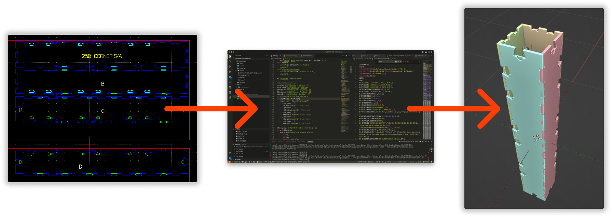
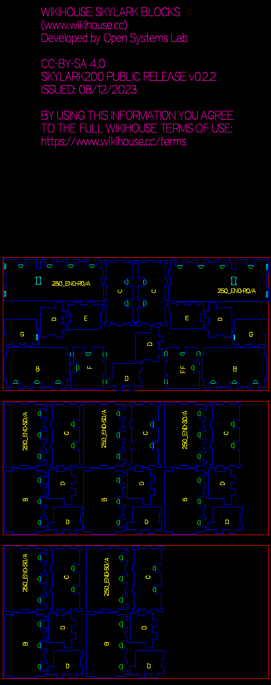
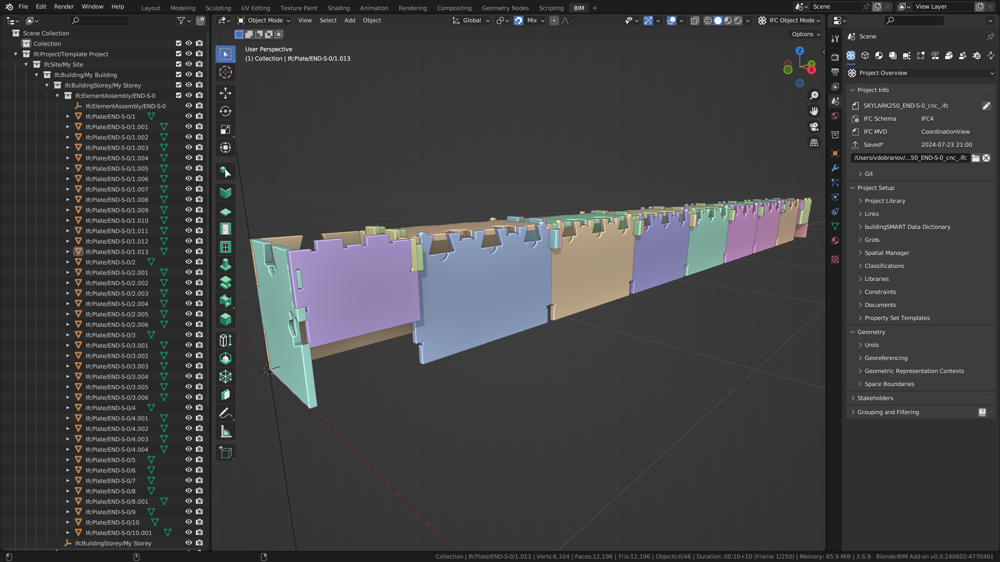

# DXF2IFC2D

Попытка получить корректные IFC-модели из DXF-заготовок для CNC-станков.

Исходный проект: [Wikihouse](https://github.com/wikihouseproject/Skylark).

Блок для экспериментов: [CORNER-S](https://www.wikihouse.cc/skylark-250/corner-s).

## Результат на 2024.07.23

### SKYLARK250_END-S-0

|DXF|IFC|
|-|-|
|||
